# Available Lenia organisms

All 528 entries from the [animal catalog](../resources/animals_dim.csv), with zero-based type IDs matching the streaming API. Dimensions and kernel radius are before applying scale. Thumbnails show the catalog seeds using the animation palette on a black background; each preview is fitted independently to 96 × 96 pixels, so thumbnail size does not indicate organism size.

| Type ID | Preview | Organism | Seed size (px) | Kernel radius |
|---:|:---:|---|---:|---:|
| 0 | 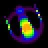 | Orbium unicaudatus (one-tailed orb) | 20 × 20 | 13 |
| 1 | 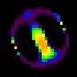 | Orbium unicaudatus ignis (one-tailed fiery orb) | 20 × 21 | 13 |
| 2 | 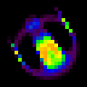 | Orbium bicaudatus (two-tailed orb) | 20 × 20 | 13 |
| 3 | 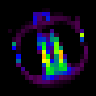 | Orbium bicaudatus ignis (two-tailed fiery orb) | 19 × 19 | 13 |
| 4 | 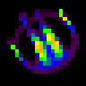 | Orbium phantasma (phantom orb) | 18 × 17 | 13 |
| 5 | 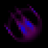 | Orbium virtualis (virtual orb) | 19 × 19 | 13 |
| 6 |  | Orbium virtualis (virtual orb) | 20 × 21 | 13 |
| 7 | 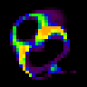 | Gyrorbium gyrans (spinning spinning orb) | 21 × 23 | 13 |
| 8 | 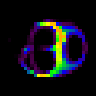 | Gyrorbium revolvens (revolving spinning orb) | 25 × 20 | 13 |
| 9 | 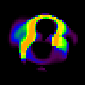 | Vagorbium undulatus (wavy wandering orb) | 39 × 32 | 20 |
| 10 | 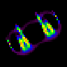 | Synorbium solidus (solid joined orb) | 34 × 28 | 13 |
| 11 | 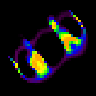 | Synorbium ignis (fiery joined orb) | 33 × 31 | 13 |
| 12 | 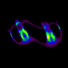 | Synorbium tractus (drawn joined orb) | 70 × 38 | 23 |
| 13 | 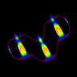 | Trisynorbium (triple joined orb) | 91 × 68 | 25 |
| 14 | 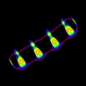 | Tetrasynorbium? (quad joined orb?) | 128 × 99 | 26 |
| 15 | 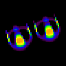 | Parorbium dividuus (divided parallel orb) | 42 × 30 | 13 |
| 16 | 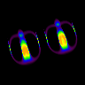 | Parorbium dividuus pedes (divided footed parallel orb) | 79 × 54 | 25 |
| 17 | 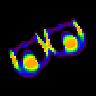 | Parorbium adhaerens (clinging parallel orb) | 42 × 33 | 13 |
| 18 | 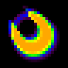 | Scutium solidus (solid shield) | 18 × 20 | 13 |
| 19 | 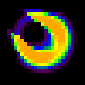 | Scutium valvatus (gated shield) | 21 × 20 | 13 |
| 20 | 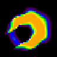 | Scutium serratus fluens (serrated flowing shield) | 31 × 30 | 15 |
| 21 | 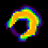 | Scutium serratus vagus (serrated wandering shield) | 22 × 22 | 10 |
| 22 |  | Scutium serratus saliens (serrated leaping shield) | 33 × 33 | 20 |
| 23 | 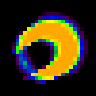 | Scutium serratus solidus (serrated solid shield) | 21 × 19 | 10 |
| 24 | 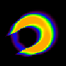 | Scutium serratus solidus (serrated solid shield) | 57 × 50 | 27 |
| 25 | 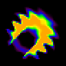 | Scutium serratus fluens (serrated flowing shield) | 42 × 40 | 18 |
| 26 |  | Scutium serratus fluens (serrated flowing shield) | 43 × 43 | 18 |
| 27 | 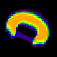 | Discutium solidus (solid double shield) | 29 × 25 | 13 |
| 28 | 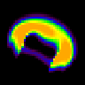 | Discutium valvatus (gated double shield) | 34 × 29 | 15 |
| 29 | 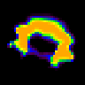 | Discutium serratus (serrated double shield) | 31 × 25 | 10 |
| 30 | 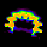 | Discutium serratus (serrated double shield) | 34 × 28 | 13 |
| 31 | 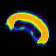 | Triscutium solidus (solid triple shield) | 41 × 33 | 13 |
| 32 | 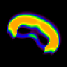 | Triscutium valvatus centrale (gated central triple shield) | 44 × 35 | 15 |
| 33 | 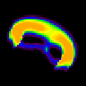 | Triscutium valvatus laterale (gated lateral triple shield) | 43 × 35 | 15 |
| 34 | 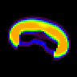 | Triscutium serratus valvatus centrale (serrated gated central triple shield) | 39 × 28 | 10 |
| 35 | 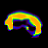 | Triscutium serratus valvatus laterale (serrated gated lateral triple shield) | 39 × 28 | 10 |
| 36 | 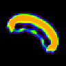 | Tetrascutium solidus (solid quad shield) | 50 × 39 | 13 |
| 37 | 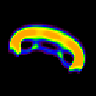 | Tetrascutium valvatus (gated quad shield) | 51 × 33 | 13 |
| 38 | 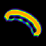 | Pentascutium solidus (solid five shield) | 58 × 45 | 13 |
| 39 | 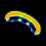 | Pentascutium valvatus (gated five shield) | 60 × 43 | 13 |
| 40 | 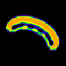 | Hexascutium solidus (solid six shield) | 70 × 47 | 13 |
| 41 | 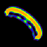 | Hexascutium valvatus (gated six shield) | 64 × 58 | 13 |
| 42 | 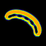 | Heptascutium (seven shield) | 79 × 59 | 13 |
| 43 | 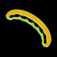 | Octascutium (eight shield) | 90 × 75 | 13 |
| 44 | 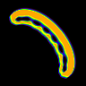 | Octascutium limus (slimy eight shield) | 80 × 84 | 13 |
| 45 | 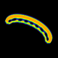 | Nonascutium (nine shield) | 110 × 70 | 13 |
| 46 | 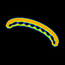 | Decascutium (ten shield) | 125 × 70 | 13 |
| 47 | 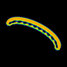 | Dodecascutium (twelve shield) | 145 × 90 | 13 |
| 48 | 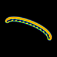 | Tetradecascutium (fourteen shield) | 173 × 91 | 13 |
| 49 | 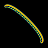 | Tetracosascutium (twenty-four shield) | 230 × 227 | 13 |
| 50 | 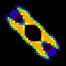 | Catenoscutium bidirectus (two-directional chain shield) | 29 × 29 | 13 |
| 51 | 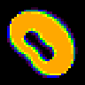 | Discutium pachus (thick double shield) | 30 × 30 | 13 |
| 52 | 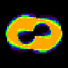 | Trihelicium pachus (thick triple spiral) | 35 × 25 | 13 |
| 53 |  | Gyropteron arcus (arched spinning wing) | 22 × 22 | 13 |
| 54 |  | Gyropteron cavus (hollow spinning wing) | 22 × 21 | 13 |
| 55 |  | Gyropteron serratus velox (serrated swift spinning wing) | 24 × 24 | 10 |
| 56 |  | Gyropteron serratus turbulentus (serrated turbulent spinning wing) | 23 × 21 | 10 |
| 57 |  | Gyropteron serratus velox (serrated swift spinning wing) | 47 × 42 | 18 |
| 58 |  | Gyropteron serratus velox (serrated swift spinning wing) | 43 × 46 | 18 |
| 59 |  | Vagopteron vagus (wandering wandering wing) | 47 × 40 | 25 |
| 60 |  | Synptera cavus saliens (hollow leaping joined wings) | 30 × 30 | 13 |
| 61 |  | Synptera cavus pedes (hollow footed joined wings) | 34 × 36 | 13 |
| 62 |  | Synptera sinus pedes (curved footed joined wings) | 34 × 31 | 13 |
| 63 |  | Pyroscutium arcus pedes (arched footed fire shield) | 34 × 32 | 13 |
| 64 |  | Pyroscutium ambiguus (ambiguous fire shield) | 35 × 24 | 13 |
| 65 |  | Synptera serratus arcus pedes (serrated arched footed joined wings) | 40 × 26 | 10 |
| 66 |  | Synptera serratus cavus labens (serrated hollow gliding joined wings) | 36 × 26 | 10 |
| 67 |  | Synptera serratus cavus saliens (serrated hollow leaping joined wings) | 36 × 25 | 10 |
| 68 |  | Synptera serratus sinus labens (serrated curved gliding joined wings) | 35 × 32 | 10 |
| 69 |  | Synptera serratus cavus pedes (serrated hollow footed joined wings) | 44 × 28 | 13 |
| 70 |  | Synptera serratus sinus pedes (serrated curved footed joined wings) | 38 × 37 | 10 |
| 71 |  | Pyroscutium ambiguus serratus (ambiguous serrated fire shield) | 41 × 32 | 13 |
| 72 |  | Paraptera arcus labens (arched gliding parallel wings) | 43 × 40 | 13 |
| 73 |  | Paraptera arcus saliens (arched leaping parallel wings) | 45 × 41 | 13 |
| 74 |  | Paraptera arcus pedes (arched footed parallel wings) | 44 × 43 | 13 |
| 75 |  | Paraptera arcus valvatus (arched gated parallel wings) | 43 × 43 | 13 |
| 76 |  | Paraptera cavus labens (hollow gliding parallel wings) | 42 × 37 | 13 |
| 77 |  | Paraptera cavus salien (hollow leaping parallel wings) | 39 × 37 | 13 |
| 78 |  | Paraptera cavus pedes (hollow footed parallel wings) | 41 × 37 | 13 |
| 79 |  | Paraptera cavus furiosus (hollow furious parallel wings) | 39 × 36 | 13 |
| 80 |  | Paraptera orbis pedes (globe footed parallel wings) | 38 × 39 | 13 |
| 81 |  | Paraptera sinus labens (curved gliding parallel wings) | 39 × 39 | 13 |
| 82 |  | Paraptera sinus pedes (curved footed parallel wings) | 42 × 36 | 13 |
| 83 |  | Paraptera superarcus saliens (super-arched leaping parallel wings) | 34 × 33 | 10 |
| 84 |  | Paraptera serratus arcus saliens (serrated arched leaping parallel wings) | 43 × 43 | 10 |
| 85 |  | Paraptera serratus cavus labens (serrated hollow gliding parallel wings) | 52 × 49 | 13 |
| 86 |  | Pentapteryx arcus labens (arched gliding five wing) | 55 × 45 | 13 |
| 87 |  | Pentapteryx arcus saliens (arched leaping five wing) | 58 × 46 | 13 |
| 88 |  | Pentapteryx arcus pedes (arched footed five wing) | 56 × 52 | 13 |
| 89 |  | Pentapteryx cavus labens (hollow gliding five wing) | 54 × 40 | 13 |
| 90 |  | Pentapteryx cavus saliens (hollow leaping five wing) | 52 × 42 | 13 |
| 91 |  | Pentapteryx cavus pedes (hollow footed five wing) | 53 × 44 | 13 |
| 92 |  | Pentapteryx cavus furiosus (hollow furious five wing) | 50 × 45 | 13 |
| 93 |  | Pentapteryx arcus valvatus (arched gated five wing) | 58 × 44 | 13 |
| 94 |  | Pentapteryx serratus cavus labens (serrated hollow gliding five wing) | 47 × 52 | 10 |
| 95 |  | Pentapteryx serratus cavus labens (serrated hollow gliding five wing) | 68 × 51 | 13 |
| 96 |  | Hexapteryx arcus labens (arched gliding six wing) | 66 × 53 | 13 |
| 97 |  | Hexapteryx cavus labens (hollow gliding six wing) | 62 × 49 | 13 |
| 98 |  | Hexapteryx serratus cavus labens (serrated hollow gliding six wing) | 56 × 60 | 10 |
| 99 |  | Hexapteryx serratus cavus labens (serrated hollow gliding six wing) | 74 × 66 | 13 |
| 100 |  | Hexapteryx serratus cavus volitans (serrated hollow flying six wing) | 71 × 75 | 13 |
| 101 |  | Heptapteryx arcus labens (arched gliding seven wing) | 70 × 65 | 13 |
| 102 |  | Heptapteryx cavus labens (hollow gliding seven wing) | 65 × 60 | 13 |
| 103 |  | Heptapteryx cavus labens cunctans (hollow gliding hesitating seven wing) | 67 × 53 | 13 |
| 104 |  | Heptapteryx serratus cavus labens (serrated hollow gliding seven wing) | 59 × 71 | 10 |
| 105 |  | Heptapteryx serratus cavus volitans (serrated hollow flying seven wing) | 87 × 82 | 13 |
| 106 |  | Octapteryx arcus labens (arched gliding eight wing) | 88 × 66 | 13 |
| 107 |  | Octapteryx cavus labens (hollow gliding eight wing) | 80 × 60 | 13 |
| 108 |  | Octapteryx serratus cavus labens (serrated hollow gliding eight wing) | 90 × 47 | 10 |
| 109 |  | Nonapteryx arcus labens (arched gliding nine wing) | 102 × 63 | 13 |
| 110 |  | Nonapteryx cavus labens (hollow gliding nine wing) | 89 × 63 | 13 |
| 111 |  | Nonapteryx serratus cavus labens (serrated hollow gliding nine wing) | 103 × 56 | 10 |
| 112 |  | Nonapteryx serratus sinus labens (serrated curved gliding nine wing) | 96 × 59 | 10 |
| 113 |  | Nonapteryx serratus cavus volitans (serrated hollow flying nine wing) | 106 × 107 | 13 |
| 114 |  | Decapteryx arcus labens (arched gliding ten wing) | 114 × 68 | 13 |
| 115 |  | Decapteryx cavus labens (hollow gliding ten wing) | 98 × 69 | 13 |
| 116 |  | Decapteryx serratus sinus labens (serrated curved gliding ten wing) | 113 × 69 | 10 |
| 117 |  | Unidecapteryx arcus alternatus (arched alternating eleven wing) | 106 × 100 | 13 |
| 118 |  | Tridecapteryx arcus alternatus (arched alternating thirteen wing) | 115 × 125 | 13 |
| 119 |  | Eicosapteryx cavus pedes (hollow footed twenty wing) | 159 × 165 | 13 |
| 120 |  | Tetracosapteryx arcus labens (arched gliding twenty-four wing) | 224 × 208 | 13 |
| 121 |  | Tetracosapteryx cavus labens (hollow gliding twenty-four wing) | 184 × 195 | 13 |
| 122 |  | Paracaudopteryx orbis adhaerens labens (globe clinging gliding parallel tail-wing) | 41 × 42 | 13 |
| 123 |  | Paracaudopteryx orbis dividuus labens (globe divided gliding parallel tail-wing) | 41 × 43 | 13 |
| 124 |  | Paracaudopteryx cavus pedes (hollow footed parallel tail-wing) | 40 × 41 | 13 |
| 125 |  | Pentacaudopteryx (five tail-wing) | 49 × 50 | 13 |
| 126 |  | Pentacaudopteryx nimius (excessive five tail-wing) | 58 × 49 | 13 |
| 127 |  | Hexacaudopteryx (six tail-wing) | 59 × 59 | 13 |
| 128 |  | Hexacaudopteryx orbis (globe six tail-wing) | 52 × 58 | 13 |
| 129 |  | Heptacaudopteryx (seven tail-wing) | 68 × 65 | 13 |
| 130 |  | Octacaudopteryx (eight tail-wing) | 78 × 73 | 13 |
| 131 |  | Octacaudopteryx orbis (globe eight tail-wing) | 68 × 80 | 13 |
| 132 |  | Hexacaudocornium cavus labens (hollow gliding six tail-horn) | 65 × 48 | 10 |
| 133 |  | Octacaudocornium cavus labens (hollow gliding eight tail-horn) | 89 × 47 | 10 |
| 134 |  | Decacaudocornium cavus labens (hollow gliding ten tail-horn) | 108 × 66 | 10 |
| 135 |  | Catenopteryx increscens (growing chain wing) | 57 × 65 | 13 |
| 136 |  | Catenopteryx increscens (growing chain wing) | 62 × 68 | 13 |
| 137 |  | Catenopteryx cyclon (cyclone chain wing) | 33 × 35 | 13 |
| 138 |  | Catenopteryx cyclon scutoides (cyclone shield-like chain wing) | 36 × 36 | 13 |
| 139 |  | Catenopteryx cinguli (ringed chain wing) | 256 × 22 | 13 |
| 140 |  | Catenopteryx cinguli (ringed chain wing) | 128 × 128 | 30 |
| 141 |  | Catenopteryx serratus cinguli (serrated ringed chain wing) | 128 × 42 | 10 |
| 142 |  | Helicium solidus (solid spiral) | 41 × 29 | 13 |
| 143 |  | Helicium arcus saliens (arched leaping spiral) | 38 × 23 | 13 |
| 144 |  | Helicium arcus saliens ignis (arched leaping fiery spiral) | 39 × 29 | 13 |
| 145 |  | Helicium arcus pedes (arched footed spiral) | 38 × 24 | 13 |
| 146 |  | Helicium cavus pedes (hollow footed spiral) | 34 × 26 | 13 |
| 147 |  | Helicium serratus ocellus (serrated little eye spiral) | 38 × 25 | 10 |
| 148 |  | Helicium serratus velox (serrated swift spiral) | 35 × 30 | 10 |
| 149 |  | Helicium serratus turbulentus (serrated turbulent spiral) | 36 × 28 | 10 |
| 150 |  | Helicium serratus turbulentus (serrated turbulent spiral) | 66 × 46 | 18 |
| 151 |  | Helicium serratus turbulentus (serrated turbulent spiral) | 65 × 44 | 18 |
| 152 |  | Pentahelicium solidus (solid five spiral) | 61 × 28 | 13 |
| 153 |  | Pentahelicium ignis (fiery five spiral) | 58 × 32 | 13 |
| 154 |  | Pentahelicium serratus limus (serrated slimy five spiral) | 63 × 31 | 10 |
| 155 |  | Heptahelicium solidus (solid seven spiral) | 89 × 39 | 13 |
| 156 |  | Heptahelicium ignis (fiery seven spiral) | 89 × 42 | 13 |
| 157 |  | Heptahelicium serratus limus (serrated slimy seven spiral) | 89 × 42 | 10 |
| 158 |  | Nonahelicium solidus (solid nine spiral) | 102 × 82 | 13 |
| 159 |  | Nonahelicium ignis (fiery nine spiral) | 110 × 52 | 13 |
| 160 |  | Tetrahelicium serratus (serrated four spiral) | 46 × 26 | 10 |
| 161 |  | Tetrahelicium serratus fractus (serrated broken four spiral) | 48 × 25 | 10 |
| 162 |  | Tetrahelicium serratus turbulentus (serrated turbulent four spiral) | 48 × 30 | 10 |
| 163 |  | Hexahelicium solidus (solid six spiral) | 72 × 42 | 13 |
| 164 |  | Hexahelicium ignis (fiery six spiral) | 72 × 36 | 13 |
| 165 |  | Hexahelicium serratus (serrated six spiral) | 75 × 35 | 10 |
| 166 |  | Octahelicium (eight spiral) | 96 × 50 | 13 |
| 167 |  | Octahelicium serratus (serrated eight spiral) | 106 × 48 | 10 |
| 168 |  | Decahelicium (ten spiral) | 116 × 76 | 13 |
| 169 |  | Decahelicium serratus (serrated ten spiral) | 117 × 50 | 9 |
| 170 |  | Dodecahelicium limus (slimy twelve spiral) | 105 × 47 | 10 |
| 171 |  | Tetradecahelicium (fourteen spiral) | 148 × 60 | 13 |
| 172 |  | Catenohelicium monospirae (single-spiral chain spiral) | 67 × 57 | 13 |
| 173 |  | Catenohelicium bispirae vacuoides (double-spiral void-like chain spiral) | 66 × 56 | 13 |
| 174 |  | Catenohelicium bispirae scutoides (double-spiral shield-like chain spiral) | 60 × 28 | 13 |
| 175 |  | Circium lithos apertus (stone open circle) | 14 × 14 | 15 |
| 176 |  | Circium lithos opertus (stone closed circle) | 18 × 18 | 13 |
| 177 |  | Circium ventilans (fanning circle) | 16 × 16 | 13 |
| 178 |  | Cumulocircium lithos (stone heaped circle) | 17 × 17 | 18 |
| 179 |  | Cumulocircium scintillans (sparkling heaped circle) | 65 × 64 | 18 |
| 180 |  | Cumulocircium scintillans (sparkling heaped circle) | 26 × 26 | 15 |
| 181 |  | Cumulocircium scintillans (sparkling heaped circle) | 34 × 34 | 25 |
| 182 |  | Cumulocircium lithos (stone heaped circle) | 29 × 29 | 25 |
| 183 |  | Cumulocircium gyrans limus (spinning slimy heaped circle) | 32 × 31 | 26 |
| 184 |  | Cumulocircium lithos limus (stone slimy heaped circle) | 17 × 18 | 15 |
| 185 |  | max-fleet | 214 × 169 | 13 |
| 186 |  | Echinium solidus (solid spine) | 31 × 39 | 18 |
| 187 |  | Echinium limus (slimy spine) | 36 × 35 | 18 |
| 188 |  | Circoechinium ventilans (fanning circle spine) | 55 × 54 | 18 |
| 189 |  | Circoechinium inconditus (disordered circle spine) | 59 × 51 | 18 |
| 190 |  | Aerogeminium volitans (flying air twin) | 49 × 32 | 18 |
| 191 |  | Aerogeminium ambiguus (ambiguous air twin) | 50 × 35 | 18 |
| 192 |  | Aerogeminium immotus (motionless air twin) | 50 × 45 | 18 |
| 193 |  | Aerogeminium vagus (wandering air twin) | 34 × 41 | 18 |
| 194 |  | Aerogeminium repens (creeping air twin) | 66 × 54 | 21 |
| 195 |  | Aerogeminium immotus (motionless air twin) | 69 × 71 | 21 |
| 196 |  | Hydrogeminium saliens (leaping water twin) | 75 × 71 | 27 |
| 197 |  | Hydrogeminium limus (slimy water twin) | 50 × 40 | 18 |
| 198 |  | Hydrogeminium natans (swimming water twin) | 55 × 51 | 18 |
| 199 |  | Hydrogeminiwum labens (gliding water twin) | 47 × 47 | 18 |
| 200 |  | Terrageminium (earth twin) | 66 × 38 | 27 |
| 201 |  | Terrageminium (earth twin) | 67 × 35 | 27 |
| 202 |  | Terrageminium (earth twin) | 66 × 38 | 27 |
| 203 |  | Terrageminium saliens (leaping earth twin) | 74 × 35 | 27 |
| 204 |  | Terrageminium lithos (stone earth twin) | 72 × 39 | 27 |
| 205 |  | Terrageminium (earth twin) | 69 × 35 | 27 |
| 206 |  | Terrageminium saliens (leaping earth twin) | 75 × 36 | 27 |
| 207 |  | Terrageminium tardus (slow earth twin) | 86 × 48 | 27 |
| 208 |  | Gyrogeminium gyrans (spinning spinning twin) | 62 × 40 | 18 |
| 209 |  | Gyrogeminium gyrans (spinning spinning twin) | 55 × 41 | 18 |
| 210 |  | Gyrogeminium revolvens (revolving spinning twin) | 58 × 41 | 18 |
| 211 |  | Gyrogeminium serratus (serrated spinning twin) | 53 × 38 | 18 |
| 212 |  | Trigeminium arcus pedes (arched footed triple twin) | 62 × 55 | 18 |
| 213 |  | Trigeminium arcus natans (arched swimming triple twin) | 63 × 57 | 18 |
| 214 |  | Gyrotrigeminium gyrans (spinning spinning triple twin) | 66 × 61 | 18 |
| 215 |  | Tetrageminium arcus pedes (arched footed quad twin) | 63 × 79 | 18 |
| 216 |  | Tetrageminium arcus natans (arched swimming quad twin) | 73 × 74 | 20 |
| 217 |  | Tetrageminium cavus saliens (hollow leaping quad twin) | 78 × 80 | 18 |
| 218 |  | Heptageminium natans (swimming seven twin) | 69 × 43 | 10 |
| 219 |  | Tetradecactenium (fourteen comb) | 100 × 88 | 20 |
| 220 |  | Pentadecactenium (fifteen comb) | 103 × 93 | 20 |
| 221 |  | Eicosactenium (twenty comb) | 110 × 110 | 18 |
| 222 |  | Ctenium ambiguus (ambiguous comb) | 88 × 78 | 18 |
| 223 |  | Catenoctenium monospirae (single-spiral chain comb) | 73 × 77 | 18 |
| 224 |  | Catenoctenium cinguli (ringed chain comb) | 128 × 31 | 18 |
| 225 |  | Catenoctenium iridescens (iridescent chain comb) | 121 × 120 | 18 |
| 226 |  | Urium brevis (short tail) | 60 × 58 | 13 |
| 227 |  | Urium longus (long tail) | 61 × 65 | 13 |
| 228 |  | Urium longus limus (long slimy tail) | 65 × 66 | 13 |
| 229 |  | Urium longus vagus (long wandering tail) | 63 × 60 | 13 |
| 230 |  | Urium perlongus (very long tail) | 76 × 84 | 13 |
| 231 |  | Pentaurium brevis (short five tail) | 69 × 62 | 13 |
| 232 |  | Pentaurium longus (long five tail) | 70 × 69 | 13 |
| 233 |  | Pentaurium perlongus (very long five tail) | 79 × 85 | 13 |
| 234 |  | Hexaurium brevis (short six tail) | 76 × 76 | 13 |
| 235 |  | Hexaurium extendens (extending six tail) | 76 × 78 | 13 |
| 236 |  | Heptaurium longus (long seven tail) | 89 × 86 | 13 |
| 237 |  | Heptaurium perlongus (very long seven tail) | 99 × 99 | 13 |
| 238 |  | Octaurium extendens (extending eight tail) | 107 × 96 | 13 |
| 239 |  | Kronium solidus (solid crown) | 23 × 23 | 18 |
| 240 |  | Kronium tardus (slow crown) | 22 × 21 | 18 |
| 241 |  | Kronium vagus (wandering crown) | 22 × 24 | 18 |
| 242 |  | Kronium saliens (leaping crown) | 24 × 23 | 18 |
| 243 |  | Kronium limus (slimy crown) | 28 × 28 | 18 |
| 244 |  | Kronium dividuus (divided crown) | 26 × 25 | 18 |
| 245 |  | Kronium dividuus pedes (divided footed crown) | 24 × 25 | 18 |
| 246 |  | Kronium solidus (solid crown) | 27 × 28 | 18 |
| 247 |  | Kronium saliens (leaping crown) | 27 × 25 | 15 |
| 248 |  | Kronium vagus (wandering crown) | 38 × 42 | 27 |
| 249 |  | Kronium vagus (wandering crown) | 48 × 42 | 27 |
| 250 |  | Kronium pedes (footed crown) | 45 × 45 | 27 |
| 251 |  | Kronium solidus (solid crown) | 29 × 29 | 18 |
| 252 |  | Kronium gyrans (spinning crown) | 45 × 45 | 27 |
| 253 |  | Gyrokronium gyrans (spinning spinning crown) | 25 × 23 | 18 |
| 254 |  | Argentokronium solidus (solid silver crown) | 30 × 24 | 18 |
| 255 |  | Ferrokronium solidus (solid iron crown) | 28 × 28 | 18 |
| 256 |  | Ferrokronium valvatus centrale (gated central iron crown) | 27 × 29 | 18 |
| 257 |  | Ferrokronium valvatus laterale (gated lateral iron crown) | 28 × 27 | 18 |
| 258 |  | Ferrokronium tardus (slow iron crown) | 28 × 26 | 18 |
| 259 |  | Ferrokronium circularis (circular iron crown) | 27 × 28 | 18 |
| 260 |  | Ferrokronium solidus (solid iron crown) | 28 × 29 | 18 |
| 261 |  | Ferrokronium bullans (bubbling iron crown) | 26 × 26 | 18 |
| 262 |  | Ferrokronium bullans (bubbling iron crown) | 27 × 28 | 18 |
| 263 |  | Aurokronium arcus (arched gold crown) | 34 × 30 | 18 |
| 264 |  | Aurokronium cavus (hollow gold crown) | 33 × 28 | 18 |
| 265 |  | Aurokronium gyrans (spinning gold crown) | 35 × 29 | 20 |
| 266 |  | Synkronium arcus (arched joined crown) | 35 × 34 | 18 |
| 267 |  | Synkronium cavus (hollow joined crown) | 31 × 38 | 18 |
| 268 |  | Florakronium arcus (arched flower crown) | 40 × 31 | 18 |
| 269 |  | Allikronium (garlic crown) | 39 × 35 | 25 |
| 270 |  | Parakronium arcus (arched parallel crown) | 41 × 39 | 18 |
| 271 |  | Parakronium cavus (hollow parallel crown) | 46 × 36 | 18 |
| 272 |  | Pentakronium arcus (arched five crown) | 51 × 44 | 18 |
| 273 |  | Pentakronium cavus (hollow five crown) | 52 × 43 | 18 |
| 274 |  | Hexakronium arcus (arched six crown) | 57 × 51 | 18 |
| 275 |  | Hexakronium cavus (hollow six crown) | 54 × 47 | 18 |
| 276 |  | Heptakronium arcus (arched seven crown) | 65 × 57 | 18 |
| 277 |  | Paracaudokronium cavus (hollow parallel tail-crown) | 66 × 52 | 27 |
| 278 |  | Pentacaudokronium cavus (hollow five tail-crown) | 72 × 68 | 27 |
| 279 |  | Hexacaudokronium cavus extendus (hollow extended six tail-crown) | 82 × 78 | 27 |
| 280 |  | Pareurycaudokronium arcus (arched parallel broad-tail crown) | 43 × 38 | 27 |
| 281 |  | Penteurycaudokronium arcus (arched five broad-tail crown) | 51 × 42 | 27 |
| 282 |  | Penteurycaudokronium arcus extendens (arched extending five broad-tail crown) | 54 × 52 | 27 |
| 283 |  | Hexeurycaudokronium arcus (arched six broad-tail crown) | 61 × 44 | 27 |
| 284 |  | Catenokronium cinguli (ringed chain crown) | 128 × 26 | 18 |
| 285 |  | Pentaquadrium solidus (solid five square) | 51 × 52 | 36 |
| 286 |  | Pentaquadrium minus (smaller five square) | 47 × 46 | 36 |
| 287 |  | Pentaquadrium gyrans (spinning five square) | 47 × 42 | 36 |
| 288 |  | Pentaquadrium metamorpha (shape-shifting five square) | 49 × 51 | 36 |
| 289 |  | Heptaquadrium solidus (solid seven square) | 47 × 45 | 30 |
| 290 |  | Tetravolvium (four roller) | 32 × 22 | 18 |
| 291 |  | Hexavolvium (six roller) | 55 × 33 | 24 |
| 292 |  | Hexavolvium resiliens (bouncing six roller) | 43 × 27 | 18 |
| 293 |  | Hexavolvium ulterior (further six roller) | 41 × 26 | 18 |
| 294 |  | Hexadentium rotans (rotating six tooth) | 35 × 35 | 18 |
| 295 |  | Hexadentium scintillans (sparkling six tooth) | 34 × 35 | 18 |
| 296 |  | Hexadentium torquens (twisting six tooth) | 31 × 31 | 18 |
| 297 |  | Hexadentium inversus (inverted six tooth) | 28 × 28 | 24 |
| 298 |  | Hexadentium inversus limus (inverted slimy six tooth) | 43 × 43 | 36 |
| 299 |  | Heptadentium inversus (inverted seven tooth) | 39 × 40 | 36 |
| 300 |  | Heptadentium rotans (rotating seven tooth) | 37 × 37 | 18 |
| 301 |  | Heptadentium scintillans (sparkling seven tooth) | 38 × 38 | 18 |
| 302 |  | Octadentium volubilis currens (nimble running eight tooth) | 40 × 36 | 27 |
| 303 |  | Octadentium rotans (rotating eight tooth) | 43 × 43 | 18 |
| 304 |  | Octadentium scintillans (sparkling eight tooth) | 42 × 43 | 18 |
| 305 |  | Octadentium alternatus (alternating eight tooth) | 42 × 42 | 18 |
| 306 |  | Nonadentium rotans (rotating nine tooth) | 48 × 47 | 18 |
| 307 |  | Nonadentium scintillans (sparkling nine tooth) | 46 × 46 | 18 |
| 308 |  | Decadentium rotans bioculi (rotating two-eyed ten tooth) | 53 × 51 | 18 |
| 309 |  | Decadentium rotans trioculi (rotating three-eyed ten tooth) | 49 × 48 | 18 |
| 310 |  | Decadentium rotans (rotating ten tooth) | 48 × 49 | 27 |
| 311 |  | Decadentium rotans (rotating ten tooth) | 44 × 44 | 27 |
| 312 |  | Decadentium rotans (rotating ten tooth) | 46 × 47 | 36 |
| 313 |  | Decadentium vagus (wandering ten tooth) | 50 × 47 | 36 |
| 314 |  | Decadentium volubilis (nimble ten tooth) | 45 × 46 | 36 |
| 315 |  | Undecadentium rotans (rotating eleven tooth) | 51 × 50 | 36 |
| 316 |  | Undecadentium scintillans (sparkling eleven tooth) | 51 × 50 | 36 |
| 317 |  | Dodecadentium rotans (rotating twelve tooth) | 55 × 55 | 36 |
| 318 |  | Dodecadentium scintillans (sparkling twelve tooth) | 55 × 54 | 36 |
| 319 |  | Tridecadentium rotans (rotating thirteen tooth) | 58 × 57 | 36 |
| 320 |  | Tridecadentium scintillans (sparkling thirteen tooth) | 58 × 57 | 36 |
| 321 |  | Hexadecadentium rotans (rotating sixteen tooth) | 68 × 70 | 27 |
| 322 |  | Trigonium lithos (stone triangle) | 43 × 41 | 36 |
| 323 |  | Trigonium gyrans (spinning triangle) | 47 × 43 | 36 |
| 324 |  | Trigonium rotans (rotating triangle) | 42 × 42 | 36 |
| 325 |  | Trigonium ventilans (fanning triangle) | 42 × 41 | 36 |
| 326 |  | Trigonium gyrans (spinning triangle) | 42 × 43 | 36 |
| 327 |  | Trigonium (triangle) | 46 × 49 | 36 |
| 328 |  | Crucium solidus (solid cross) | 37 × 37 | 27 |
| 329 |  | Crucium solidus (solid cross) | 37 × 38 | 27 |
| 330 |  | Crucium solidus (solid cross) | 44 × 44 | 36 |
| 331 |  | Crucium saliens (leaping cross) | 42 × 43 | 36 |
| 332 |  | Crucium metamorpha (shape-shifting cross) | 50 × 54 | 36 |
| 333 |  | Crucium rotans (rotating cross) | 53 × 52 | 36 |
| 334 |  | Crucium ventilans (fanning cross) | 39 × 39 | 27 |
| 335 |  | Crucium ventilans (fanning cross) | 50 × 50 | 27 |
| 336 |  | Asterium solidus (solid star) | 42 × 42 | 27 |
| 337 |  | Asterium limus (slimy star) | 46 × 44 | 27 |
| 338 |  | Asterium gyrans (spinning star) | 45 × 48 | 27 |
| 339 |  | Asterium tardus (slow star) | 46 × 47 | 27 |
| 340 |  | Asterium torquens (twisting star) | 45 × 45 | 27 |
| 341 |  | Asterium inversus (inverted star) | 45 × 46 | 27 |
| 342 |  | Asterium scintillans (sparkling star) | 47 × 46 | 27 |
| 343 |  | Asterium scintillans (sparkling star) | 54 × 56 | 27 |
| 344 |  | Asterium fluitans (drifting star) | 46 × 45 | 27 |
| 345 |  | Asterium ventilans (fanning star) | 47 × 46 | 27 |
| 346 |  | Asterium reversus (reversed star) | 47 × 45 | 27 |
| 347 |  | Asterium limus (slimy star) | 42 × 44 | 27 |
| 348 |  | Asterium vagus (wandering star) | 43 × 42 | 27 |
| 349 |  | Asterium vagus (wandering star) | 42 × 42 | 27 |
| 350 |  | Asterium vagus (wandering star) | 38 × 39 | 27 |
| 351 |  | Asterium solidus (solid star) | 56 × 57 | 36 |
| 352 |  | Asterium metamorpha (shape-shifting star) | 46 × 47 | 27 |
| 353 |  | Asterium metamorpha currens (shape-shifting running star) | 54 × 55 | 36 |
| 354 |  | Asterium metamorpha pausans (shape-shifting pausing star) | 40 × 41 | 27 |
| 355 |  | Asterium nausia (nauseous star) | 60 × 61 | 36 |
| 356 |  | Asterium incarceratus (imprisoned star) | 34 × 38 | 18 |
| 357 |  | Asterium incarceratus (imprisoned star) | 41 × 37 | 18 |
| 358 |  | Asterium incarceratus (imprisoned star) | 31 × 32 | 18 |
| 359 |  | Asterium solidus (solid star) | 42 × 44 | 27 |
| 360 |  | Nivium metamorpha (shape-shifting snowflake) | 47 × 46 | 27 |
| 361 |  | Nivium solidus (solid snowflake) | 53 × 49 | 27 |
| 362 |  | Nivium solidus (solid snowflake) | 48 × 56 | 27 |
| 363 |  | Nivium lithos (stone snowflake) | 53 × 49 | 27 |
| 364 |  | Nivium saliens (leaping snowflake) | 51 × 49 | 27 |
| 365 |  | Nivium solidus (solid snowflake) | 72 × 68 | 36 |
| 366 |  | Nivium incarceratus (imprisoned snowflake) | 39 × 44 | 18 |
| 367 |  | Nivium ninjitsu (ninjutsu snowflake) | 41 × 43 | 18 |
| 368 |  | Nivium corruptus (corrupted snowflake) | 59 × 46 | 27 |
| 369 |  | Nivium scintillans (sparkling snowflake) | 37 × 38 | 27 |
| 370 |  | Crucium rotans (rotating cross) | 39 × 39 | 27 |
| 371 |  | Asterium rotans (rotating star) | 46 × 45 | 27 |
| 372 |  | Asterium rotans (rotating star) | 43 × 42 | 27 |
| 373 |  | Asterium rotans (rotating star) | 54 × 56 | 36 |
| 374 |  | Asterium rotans (rotating star) | 60 × 59 | 36 |
| 375 |  | Nivium rotans (rotating snowflake) | 50 × 47 | 27 |
| 376 |  | Nivium rotans trigonus (rotating triangular snowflake) | 45 × 46 | 27 |
| 377 |  | Nivium rotans & rotans trigonus (rotating snowflake & triangular rotans) | 108 × 102 | 27 |
| 378 |  | Pentabullium vagus (wandering five bubble) | 35 × 35 | 27 |
| 379 |  | Pentabullium saliens (leaping five bubble) | 30 × 30 | 27 |
| 380 |  | Hexabullium solidus (solid six bubble) | 37 × 36 | 27 |
| 381 |  | Hexabullium saliens (leaping six bubble) | 32 × 32 | 27 |
| 382 |  | Hexabullium saliens (leaping six bubble) | 30 × 29 | 27 |
| 383 |  | Hexabullium pedes (footed six bubble) | 35 × 34 | 27 |
| 384 |  | Hexabullium gyrans (spinning six bubble) | 33 × 32 | 27 |
| 385 |  | Hexabullium metamorpha (shape-shifting six bubble) | 47 × 43 | 41 |
| 386 |  | Hexabullium bullans (bubbling six bubble) | 31 × 31 | 27 |
| 387 |  | Hexabullium immotus (motionless six bubble) | 37 × 38 | 27 |
| 388 |  | Hexabullium gyrans (spinning six bubble) | 35 × 35 | 27 |
| 389 |  | Hexabullium vagus (wandering six bubble) | 36 × 34 | 27 |
| 390 |  | Hexabullium ephemerus (ephemeral six bubble) | 36 × 37 | 27 |
| 391 |  | Hexabullium ventilans (fanning six bubble) | 30 × 29 | 27 |
| 392 |  | Hexabullium metamorpha (shape-shifting six bubble) | 31 × 30 | 27 |
| 393 |  | Hexabullium solidus (solid six bubble) | 34 × 34 | 27 |
| 394 |  | Heptabullium bullans (bubbling seven bubble) | 31 × 32 | 27 |
| 395 |  | Heptabullium arcus labens (arched gliding seven bubble) | 36 × 37 | 27 |
| 396 |  | Heptabullium arcus metamorpha (arched shape-shifting seven bubble) | 36 × 35 | 27 |
| 397 |  | Heptabullium arcus labens (arched gliding seven bubble) | 43 × 40 | 27 |
| 398 |  | Heptabullium arcus gyrans (arched spinning seven bubble) | 38 × 39 | 27 |
| 399 |  | Heptabullium arcus valvatus (arched gated seven bubble) | 36 × 34 | 27 |
| 400 |  | Heptabullium arcus anulus (arched ringed seven bubble) | 38 × 34 | 27 |
| 401 |  | Heptabullium arcus gyrans (arched spinning seven bubble) | 33 × 32 | 27 |
| 402 |  | Heptabullium arcus gyrans (arched spinning seven bubble) | 34 × 36 | 27 |
| 403 |  | Heptabullium arcus gyrans (arched spinning seven bubble) | 31 × 34 | 27 |
| 404 |  | Heptabullium arcus metamorpha (arched shape-shifting seven bubble) | 34 × 32 | 27 |
| 405 |  | Heptabullium arcus laminae (arched layered seven bubble) | 24 × 24 | 18 |
| 406 |  | Heptabullium cavus gyrans (hollow spinning seven bubble) | 32 × 30 | 18 |
| 407 |  | Heptabullium cavus gyrans (hollow spinning seven bubble) | 32 × 34 | 27 |
| 408 |  | Heptabullium cavus gyrans (hollow spinning seven bubble) | 35 × 36 | 27 |
| 409 |  | Heptabullium cavus gyrans (hollow spinning seven bubble) | 39 × 36 | 30 |
| 410 |  | Heptabullium cavus labens (hollow gliding seven bubble) | 34 × 34 | 27 |
| 411 |  | Heptabullium cavus metamorpha (hollow shape-shifting seven bubble) | 30 × 30 | 27 |
| 412 |  | Heptabullium cavus metamorpha (hollow shape-shifting seven bubble) | 36 × 35 | 27 |
| 413 |  | Heptabullium cavus metamorpha (hollow shape-shifting seven bubble) | 33 × 38 | 27 |
| 414 |  | Heptabullium anulus labens (ringed gliding seven bubble) | 32 × 34 | 27 |
| 415 |  | Heptabullium anulus repetens (ringed repeating seven bubble) | 32 × 31 | 27 |
| 416 |  | Nonabullium vagus (wandering nine bubble) | 34 × 34 | 27 |
| 417 |  | Nonabullium solidus (solid nine bubble) | 44 × 44 | 36 |
| 418 |  | Nonabullium valvatus (gated nine bubble) | 44 × 42 | 36 |
| 419 |  | Nonabullium tardus (slow nine bubble) | 59 × 58 | 27 |
| 420 |  | Decabullium tardus (slow ten bubble) | 48 × 43 | 27 |
| 421 |  | Decabullium metamorpha (shape-shifting ten bubble) | 48 × 44 | 27 |
| 422 |  | Unidecabullium bullans (bubbling eleven bubble) | 42 × 42 | 27 |
| 423 |  | Circobullium gyrans (spinning circle bubble) | 34 × 35 | 30 |
| 424 |  | Circobullium gyrans (spinning circle bubble) | 34 × 32 | 27 |
| 425 |  | Dilapillium inversus (inverted two pebble) | 19 × 17 | 18 |
| 426 |  | Dilapillium inversus (inverted two pebble) | 29 × 27 | 27 |
| 427 |  | Dilapillium rotans (rotating two pebble) | 20 × 19 | 18 |
| 428 |  | Dilapillium limus (slimy two pebble) | 21 × 20 | 18 |
| 429 |  | Trilapillium inversus (inverted three pebble) | 22 × 22 | 18 |
| 430 |  | Trilapillium rotans (rotating three pebble) | 21 × 21 | 18 |
| 431 |  | Trilapillium torquens (twisting three pebble) | 20 × 20 | 18 |
| 432 |  | Trilapillium vagus (wandering three pebble) | 20 × 20 | 18 |
| 433 |  | Trilapillium rotans (rotating three pebble) | 19 × 19 | 27 |
| 434 |  | Tetralapillium rotans (rotating four pebble) | 21 × 22 | 18 |
| 435 |  | Tetralapillium torquens (twisting four pebble) | 20 × 20 | 18 |
| 436 |  | Tetralapillium lithos (stone four pebble) | 19 × 19 | 18 |
| 437 |  | Tetralapillium lithos currens (stone running four pebble) | 27 × 27 | 27 |
| 438 |  | Tetralapillium inversus (inverted four pebble) | 31 × 31 | 30 |
| 439 |  | Tetralapillium metamorpha (shape-shifting four pebble) | 21 × 21 | 18 |
| 440 |  | Tetralapillium metamorpha (shape-shifting four pebble) | 23 × 22 | 18 |
| 441 |  | Pentalapillium rotans (rotating five pebble) | 28 × 29 | 27 |
| 442 |  | Pentalapillium inversus (inverted five pebble) | 29 × 28 | 27 |
| 443 |  | Hexalapillium ventilans (fanning six pebble) | 31 × 27 | 27 |
| 444 |  | Hexalapillium trigonus (triangular six pebble) | 28 × 27 | 27 |
| 445 |  | Hexalapillium volubilis (nimble six pebble) | 31 × 30 | 27 |
| 446 |  | Hexalapillium lithos (stone six pebble) | 28 × 27 | 27 |
| 447 |  | Hexalapillium lithos (stone six pebble) | 34 × 34 | 27 |
| 448 |  | Heptalapillium quadrus (square seven pebble) | 28 × 28 | 27 |
| 449 |  | Heptalapillium lithos (stone seven pebble) | 40 × 39 | 36 |
| 450 |  | Heptalapillium ventilans (fanning seven pebble) | 41 × 42 | 36 |
| 451 |  | Heptalapillium tardus (slow seven pebble) | 32 × 32 | 27 |
| 452 |  | Octalapillium lithos (stone eight pebble) | 40 × 40 | 36 |
| 453 |  | Octalapillium inversus (inverted eight pebble) | 39 × 39 | 36 |
| 454 |  | Decalapillium lithos (stone ten pebble) | 42 × 41 | 36 |
| 455 |  | Heptadecalapillium lithos (stone seventeen pebble) | 40 × 41 | 30 |
| 456 |  | Bifolium lithos (stone two leaf) | 31 × 33 | 27 |
| 457 |  | Bifolium lithos limus (stone slimy two leaf) | 30 × 30 | 27 |
| 458 |  | Bifolium lithos limus (stone slimy two leaf) | 31 × 31 | 27 |
| 459 |  | Bifolium lithos limus (stone slimy two leaf) | 38 × 37 | 27 |
| 460 |  | Bifolium currens (running two leaf) | 35 × 36 | 27 |
| 461 |  | Bifolium tardus (slow two leaf) | 31 × 32 | 27 |
| 462 |  | Trifolium lithos (stone three leaf) | 37 × 38 | 27 |
| 463 |  | Tetrafolium lithos (stone four leaf) | 35 × 35 | 27 |
| 464 |  | Tetrafolium lithos (stone four leaf) | 44 × 45 | 30 |
| 465 |  | Pentafolium lithos (stone five leaf) | 29 × 27 | 18 |
| 466 |  | Pentafolium lithos (stone five leaf) | 32 × 32 | 27 |
| 467 |  | Pentafolium limus (slimy five leaf) | 28 × 28 | 27 |
| 468 |  | Pentafolium scintillans (sparkling five leaf) | 43 × 43 | 28 |
| 469 |  | Hexafolium lithos (stone six leaf) | 46 × 52 | 27 |
| 470 |  | Hexafolium lithos (stone six leaf) | 48 × 49 | 36 |
| 471 |  | Hexafolium tardus (slow six leaf) | 39 × 37 | 27 |
| 472 |  | Hexafolium ephemerus (ephemeral six leaf) | 54 × 54 | 27 |
| 473 |  | Heptafolium lithos (stone seven leaf) | 40 × 39 | 27 |
| 474 |  | Heptafolium lithos (stone seven leaf) | 44 × 43 | 27 |
| 475 |  | Heptafolium lithos (stone seven leaf) | 35 × 33 | 27 |
| 476 |  | Heptafolium scintillans (sparkling seven leaf) | 33 × 35 | 27 |
| 477 |  | Heptafolium lithos (stone seven leaf) | 34 × 34 | 27 |
| 478 |  | Octafolium lithos (stone eight leaf) | 39 × 39 | 27 |
| 479 |  | Octafolium lithos (stone eight leaf) | 38 × 38 | 27 |
| 480 |  | Octafolium lithos limus (stone slimy eight leaf) | 33 × 35 | 27 |
| 481 |  | Octafolium lithos limus (stone slimy eight leaf) | 36 × 36 | 27 |
| 482 |  | Octafolium lithos limus (stone slimy eight leaf) | 39 × 37 | 27 |
| 483 |  | Octafolium inversus (inverted eight leaf) | 39 × 38 | 27 |
| 484 |  | Octafolium tardus (slow eight leaf) | 45 × 44 | 27 |
| 485 |  | Octafolium lithos (stone eight leaf) | 48 × 49 | 36 |
| 486 |  | Octafolium lithos limus (stone slimy eight leaf) | 40 × 37 | 27 |
| 487 |  | Octafolium incarceratus limus (imprisoned slimy eight leaf) | 40 × 37 | 27 |
| 488 |  | Octafolium lithos (stone eight leaf) | 45 × 45 | 36 |
| 489 |  | Nonafolium lithos (stone nine leaf) | 41 × 41 | 27 |
| 490 |  | Nonafolium lithos (stone nine leaf) | 46 × 44 | 27 |
| 491 |  | Nonafolium scintillans (sparkling nine leaf) | 40 × 40 | 27 |
| 492 |  | Nonafolium scintillans (sparkling nine leaf) | 41 × 42 | 27 |
| 493 |  | Nonafolium tardus (slow nine leaf) | 38 × 39 | 27 |
| 494 |  | Nonafolium currens (running nine leaf) | 38 × 40 | 27 |
| 495 |  | Decafolium lithos (stone ten leaf) | 55 × 58 | 27 |
| 496 |  | Unidecafolium lithos (stone eleven leaf) | 43 × 44 | 27 |
| 497 |  | Unidecafolium lithos limus (stone slimy eleven leaf) | 36 × 39 | 27 |
| 498 |  | Dodecafolium lithos (stone twelve leaf) | 54 × 53 | 27 |
| 499 |  | Dodecafolium lithos (stone twelve leaf) | 35 × 35 | 27 |
| 500 |  | Dodecafolium lithos (stone twelve leaf) | 39 × 39 | 27 |
| 501 |  | Unidecafolium & Dodecafolium lithos (eleven leaf & stone twelve leaf) | 62 × 55 | 17 |
| 502 |  | Tridecafolium bullans (bubbling thirteen leaf) | 40 × 39 | 27 |
| 503 |  | Tridecafolium nausia (nauseous thirteen leaf) | 54 × 55 | 36 |
| 504 |  | Heptafolium lithos (stone seven leaf) | 63 × 61 | 27 |
| 505 |  | Heptafolium incarceratus (imprisoned seven leaf) | 47 × 38 | 18 |
| 506 |  | Nonafolium incarceratus (imprisoned nine leaf) | 46 × 51 | 27 |
| 507 |  | Nonafolium nausia (nauseous nine leaf) | 53 × 52 | 18 |
| 508 |  | Dodecafolium nausia (nauseous twelve leaf) | 59 × 60 | 27 |
| 509 |  | Dodecafolium � Trilapillium inversus (twelve leaf x inverted three pebble) | 51 × 51 | 36 |
| 510 |  | Pentafolium � Asterium rotans (five leaf x rotating star) | 40 × 39 | 27 |
| 511 |  | Tetradecafolium � Asterium rotans (fourteen leaf x rotating star) | 42 × 42 | 27 |
| 512 |  | Pentafolium lithos (stone five leaf) | 34 × 34 | 30 |
| 513 |  | Heptafolium lithos (stone seven leaf) | 47 × 48 | 27 |
| 514 |  | Heptafolium lithos (stone seven leaf) | 63 × 63 | 36 |
| 515 |  | Heptafolium ventilans (fanning seven leaf) | 48 × 48 | 27 |
| 516 |  | Heptafolium nausia (nauseous seven leaf) | 49 × 50 | 36 |
| 517 |  | Nonafolium lithos (stone nine leaf) | 55 × 55 | 36 |
| 518 |  | Nonafolium rotans (rotating nine leaf) | 54 × 54 | 36 |
| 519 |  | Dodecafolium lithos (stone twelve leaf) | 52 × 52 | 36 |
| 520 |  | Tridecafolium lithos (stone thirteen leaf) | 48 × 48 | 36 |
| 521 |  | Amoebium foliatus (leafy amoeba) | 61 × 65 | 36 |
| 522 |  | Amoebium foliatus (leafy amoeba) | 61 × 55 | 36 |
| 523 |  | Amoebium dentalis (toothed amoeba) | 67 × 70 | 27 |
| 524 |  | Amoebium dentalis (toothed amoeba) | 67 × 71 | 27 |
| 525 |  | Amoebium dentalis (toothed amoeba) | 72 × 71 | 27 |
| 526 |  | Amoebium radiatus (rayed amoeba) | 33 × 32 | 18 |
| 527 |  | Ditubium ventilans (fanning two tube) | 128 × 128 | 36 |

[Wiki index](index.md)
